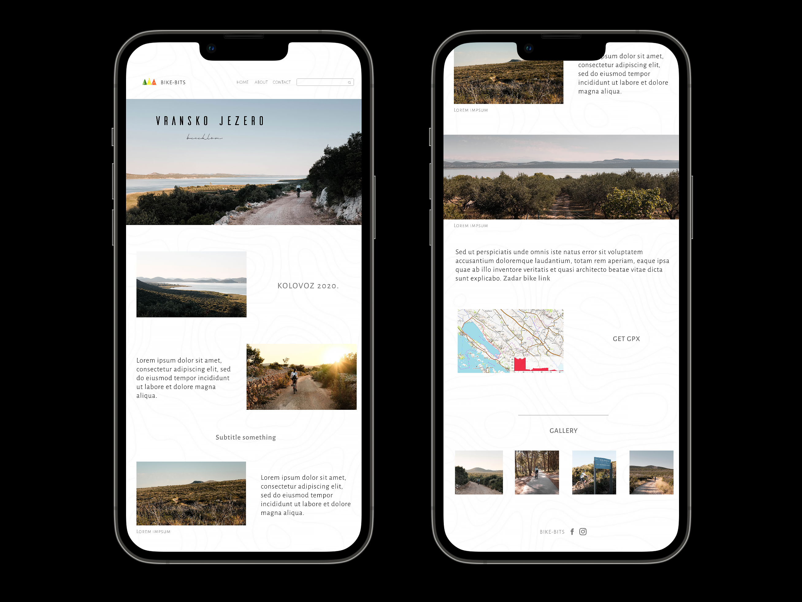

# BIKE-BITS CYCLING BLOG

 

## Technologies

 

- HTML5
- CSS3 / SCSS
- JavaScript
- JavaScript ES6 modules
- Webpack

  

 

## Features

 

- home page with blog selection, gallery preview and contact
- about section
- blog section with cycling adventures from Croatia and Slovenia
- photo gallery
- product order section
- contact

  

 

## Improvement ideas

 

- [ ] fill text content
       

- [ ] home page
- [ ] about
- [ ] blog page
- [ ] gallery page
- [ ] order form - opens when you click on a button somewhere in the gallery
- [ ] contact
       

- [ ] smooth scroll
- [ ] slider component (gallery at the bottom)
- [ ] reveal elements on scroll
- [ ] lazy loadin images
- [ ] sticky navigation
       

- [ ] modal window when clicking on a photo in the gallery at the bottom or on the screen (except the header photo)
- [ ] connect LOGO & "bike-bits" with homepage URL
- [ ] responsive search bar
- [ ] interactive map
- [ ] photo download disabled
       

- [] Responsiveness

  

 

## Mockup

  

  

 

## Try it

 

  

 

## Resources

 

- [Icon in search bar](https://nikitahl.com/search-icon-inside-input)

 

- [Smooth scroll](https://github.com/emarekica/DOM/blob/master/notes/DOM-events.md#4-implementing-smooth-scrolling)
   

- [Slider component - scroll gallery](https://github.com/emarekica/DOM/blob/master/notes/DOM-events.md#15-building-a-slider-component)
   

- [YT video to implement map](https://www.youtube.com/watch?v=bmpI252DmiI&t=45s)
   

- [Reveal elements on scroll](https://github.com/emarekica/DOM/blob/master/notes/DOM-events.md#13-revealing-elements-on-scroll)
   

- [Lazy loading images](https://github.com/emarekica/DOM/blob/master/notes/DOM-events.md#14-lazy-loading-images)
   

- [Sticky navigation](https://github.com/emarekica/DOM/blob/master/notes/DOM-events.md#implementing-sticky-navigation)
    

- [Modal window](https://www.youtube.com/watch?v=3PHXvlpOkf4&t=5943s)
   

- [Responsive design best practices](https://designmodo.com/responsive-design-examples/)
   

- [Responsive search bar](https://www.youtube.com/watch?v=4DR9Uvu1vnM)
   

- [Animations for blog](https://www.youtube.com/watch?v=sN93DRYkCO8&list=PLmGRn_VnTuAxIHKjfgoOEOIk72PeZdbaB&index=6)
   

- [Ride with GPS (API)](https://ridewithgps.com/api)

 

---

Examples:

- [Bikepacking.com](https://bikepacking.com/)
